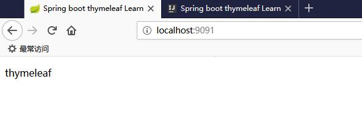
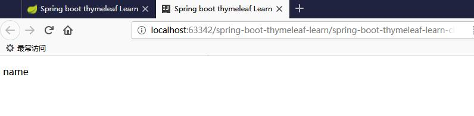

跟我学spring boot thymeleaf系列文章第一章 一个简单的示例入门

源码地址:

https://github.com/pony-maggie/spring-security-learn

第一章肯定要先引入概念。然后给一个基本的示例。


## 什么是thymeleaf

thymeleaf是一种用于Web和独立环境的现代服务器端的Java模板引擎。(这基本是官方说法)市面上的模板引擎已经有很多了，thymeleaf存在自然有它的理由。

thymeleaf其中一个亮点在于它可以不需要服务端的支持进行开发和调试，对于一些动态的后端数据可以直接在浏览器端看到显示效果（JSP就不行）。比如下面一个例子:

JSP实现
```html
<form:inputText name="userName" value="${user.name}" />
```

thymeleaf实现同样的效果， 

```html
<input type="text" name="userName" value="e-learn" th:value="${user.name}" />
```

在无法从后端拿到user.name的值的时候，thymeleaf就可以再浏览器看到缺省的效果，但是JSP不行。

下面的示例还会有相关的效果演示！


thymeleaf官方文档地址:

https://www.thymeleaf.org/doc/tutorials/3.0/usingthymeleaf.html

## 关于spring boot和thymeleaf

模板引擎已经很多了，不过spring boot官方推荐使用thymeleaf。

Spring Boot 中使用 Thymeleaf模板引擎时非常简单，Spring Boot已经提供了默认的配置，比如解析的文件前缀，文件后缀，文件编码，缓存等等，程序员需要的只是写 html 中的内容即可。

我们可以打开spring-boot-autoconfigure查看ThymeleafProperties源码，可以看到下面的默认配置：

```xml
public class ThymeleafProperties {
    private static final Charset DEFAULT_ENCODING;
    public static final String DEFAULT_PREFIX = "classpath:/templates/";
    public static final String DEFAULT_SUFFIX = ".html";
```
所以缺省要把HTML页面放在classpath:/templates/下，thymeleaf 就能自动渲染html后缀的文件。
 
**用过spring mvc的看着应该觉得很熟悉吧**


## 编写demo

spring boot工程是需要引入spring-boot-starter-thymeleaf。

```
<dependency>
            <groupId>org.springframework.boot</groupId>
            <artifactId>spring-boot-starter-thymeleaf</artifactId>
        </dependency>
```

配置文件：

```xml
spring:
  thymeleaf:
    cache: false
```
把缓存设置成false主要是方便热部署进行调试，让修改后的文件能马上生效。

index.html文件，

```html
<!DOCTYPE html>
<html xmlns="http://www.w3.org/1999/xhtml"
      xmlns:th="http://www.thymeleaf.org">
<head>
    <title>Spring boot thymeleaf Learn </title>
</head>
<body>
<div>
    <p th:text="${name}" >name</p>
</div>
</body>
</html>
```

```xml
xmlns:th="http://www.thymeleaf.org"
```
这个是thymeleaf的命名空间，要记得引入，不然一些thymeleaf的语法会报错。

我们再写一个测试controller，

```java
@Controller
public class TestController {

	@RequestMapping("/")
	public String index(Model model) {
		model.addAttribute("name", "thymeleaf");
		return "index";
	}
}
```

很简单，设置一个name属性返回给前端index.html文件。

运行spring boot，可以看到这样的效果，



前面讲到了，themeleaf可以不需要后端直接展示效果。我们把spring boot停止，然后直接用浏览器打开index.html，也可以看到缺省的效果：




