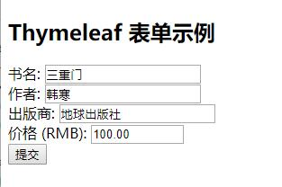

跟我学spring boot thymeleaf系列文章第二章 thymeleaf表单

源码地址:

https://github.com/pony-maggie/spring-boot-thymeleaf-learn


本章打算介绍下thymeleaf表单相关的操作。为了避免本末倒置，后端的数据我都采用模拟的方式写成固定值返回，并且不涉及数据库相关的操作。

## 编码

我们先实现一个测试controller，有两个方法，一个是get方法，用于我们在浏览器里定位到表单的页面，一个post方法，用于表单提交的处理。

get方法，

```java
@RequestMapping("/add")
	public String add(Model model) {
		model.addAttribute("book", new Book());
		return "addBook";
	}
```

这个方法很简单，返回页面的时候，带一个名为"book"，值为Book对象的数据。这个对象怎么用呢？继续看addBook.html文件，

```html
<form th:action="@{/saveBook}" th:object="${book}" method="POST">
    <label for="bookName">书名:</label>
    <input type="text" th:field="*{name}" value="" /><br/>

    <label for="author">作者:</label>
    <input type="text" th:field="*{author}" value="" /> <br/>

    <label for="publish">出版商:</label>
    <input type="text" th:field="*{publish}" value="" /> <br/>

    <label for="price">价格 (RMB):</label>
    <input type="text" th:field="*{price}" size="10" value="198" /><br/>
    
    <input type="submit" value="提交"/>
</form>
```

在html里，thymeleaf通过变量表达式"${book}"获取到后端传来的数据，并把他赋值给th:object属性。赋值完成后，th:field的赋值需要依赖th:object属性的值。
也就是说，假如Book对象没有name属性，这里用

```html
th:field="*{name}"
```
会报错！

有人可能会注意到object用的是变量表达式(${book})表达式，而field用的是星号表达式(*{name})，二者的区别在于星号表达式在选定对象上表达，而不是整个上下文。比如这里，星号表达式所作用的对象由th:object属性指定。


```html
"@{/saveBook}"
```

这是一个URL表达式，这里也可以写一个绝对网址，比如：

```html
<a th:href="@{https://www.e-learn.cn/thymeleaf/}">
```

继续来看下提交后的处理逻辑,


```java
@RequestMapping(value = { "/saveBook" }, method =  RequestMethod.POST)
	public String saveBook(@ModelAttribute Book book) {

		System.out.println("书名:" + book.getName());
		System.out.println("作者:" + book.getAuthor());

		return "result"; //返回结果页面
	}
```

@ModelAttribute是spring中的一个注解，它绑定请求参数到命令对象：放在功能处理方法的入参上时，用于将多个请求参数绑定到一个命令对象，从而简化绑定流程，而且自动暴露为模型数据用于视图页面展示时使用。

**(悄悄告诉你，不用这个注解也能拿到对象)**

我们在这个方法里只是打印两条信息，然后就返回一个结果页面，来看看这个结果页面，

```html
<body>
    <h2>结果</h2>
    <p th:text="'name: ' + ${book.name}" />
    <p th:text="'author: ' + ${book.author}" />
</body>
```

后端程序员可能看着有点奇怪(直接用对象.属性名方式获取属性值)，它实际上相当于

```java
((Book)context.getVariable("book")).getName()
```

## 测试
 
启动springboot，浏览器输入

```java
http://localhost:9091/add
```

显示如下：



输入一些信息后，提交，返回的结果如下：


```htmls
结果
name: 三重门

author: 韩寒
```